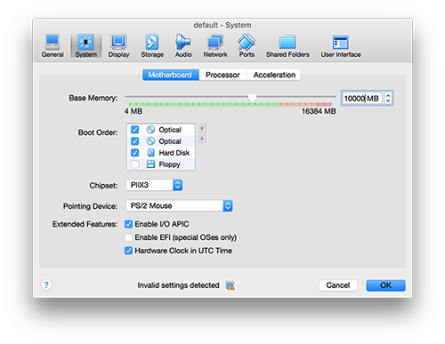
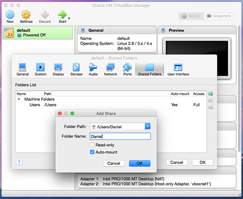

# P3: Portable Proteomics Pipeline
P3 is an open source pipelines for Mass Spectrometry Data Pre-Processing and Quantification, wrapped in Docker containers. 

Currently, there are three containers available:

#### MSGF+ (Identification)
Identification tool: Containing [MSGF+ tool developed by PNNL](https://omics.pnl.gov/software/ms-gf) as protein identification. Input: raw files (```*.mzml```, ```*.mgf```, ```*.mzxml```, ```*.ms2```, ```*.pkl```) and a dictionary (```*.fasta```) file. Output: ```*.mzid``` for each of raw files provided.

To run the container: 
```
docker pull kristiyanto/p3:msgf
docker run --rm -v /c/Users/path/to/files:/root/data kristiyanto/p3:msgf 
```

#### Label-Free/SpectrumCount Quantification
This container compute proteomics quantification for Label-Free proteomics raw data, using [MSnbase](http://bioconductor.org/packages/release/bioc/html/MSnbase.html). Input: raw files (```*.mzml```, ```*.mgf```, ```*.mzxml```, ```*.ms2```, ```*.pkl```) and idenfification files (```*.mzid```). Output: ```LabelFreeQuant.txt``` a tab deliminated file with the protein names and the spectrum counts, and ```evalue.txt``` a tab deliminated file of the evalue of the spectrums for further analysis. 


#### Label-Free/SpectrumCount (Full Pipeline)
Spectrum Count: This is a complete pipeline for label-free proteomics quantification (spectrum count). Input: raw files (```*.mzml```, ```*.mgf```, ```*.mzxml```, ```*.ms2```, ```*.pkl```) and a dictionary (```*.fasta```). Output: ```*.mzid``` for each of raw files provided, ```LabelFreeQuant.txt``` a tab deliminated file with the protein names and the spectrum counts, and ```evalue.txt``` a tab deliminated file of the evalue of the spectrums for further analysis. Identification is performed using MSGF+ tool, and quantification is performed by using  [MSnbase](http://bioconductor.org/packages/release/bioc/html/MSnbase.html).

To run the container:
```
docker pull kristiyanto/p3:spectrumcount
docker run --rm -v /c/Users/path/to/files:/root/data kristiyanto/p3:spectrumcount
```
#### iTraq for Labelled  Quantification
This container compute proteomics quantification for Labelled proteomics raw data, using iTraq from [MSnbase](http://bioconductor.org/packages/release/bioc/html/MSnbase.html). Input: raw files (```*.mzml```, ```*.mgf```, ```*.mzxml```, ```*.ms2```, ```*.pkl```) and idenfification files (```*.mzid```). Output: ```LabelledQuant.txt``` a tab deliminated file with the protein names and the spectrum counts, and ```evalue.txt``` a tab deliminated file of the evalue of the spectrums for further analysis. 


#### iTRaq for Labelled Quantification (Full Pipeline)
iTraq: This is a complete pipeline for labelled proteomics quantification. Input: raw files (```*.mzml```, ```*.mgf```, ```*.mzxml```, ```*.ms2```, ```*.pkl```) and a dictionary (```*.fasta```). Output: ```*.mzid``` for each of raw files provided, ```LabelledQuant.txt``` a tab deliminated file with the protein names and the spectrum counts, and ```evalue.txt``` a tab deliminated file of the evalue of the spectrums for further analysis. Identification is performed by utilizing [MSGF+ tool developed by PNNL](https://omics.pnl.gov/software/ms-gf), and Quantification is conducted by utilizing [MSnbase](http://bioconductor.org/packages/release/bioc/html/MSnbase.html), a bioconductor package by Laurent Gatto _et. all._

To run the container:
```
docker pull kristiyanto/p3:spectrumcount
docker run --rm -v /c/Users/path/to/files:/root/data kristiyanto/p3:itraq 
```

### Requirements
To run P3, Docker engine must be installed. [Click here](https://docs.docker.com/engine/installation/) for a detailed information to install Docker engine on various operating system including Windows and MacOS.

Protein identification and quantification is a computationally intensive process. Depending on the size of the data, at least 4Gb available memory on the Docker Machine is required. Click here for more information on increasing the memory allocation for Docker engine on VirtualBox machine for MacOS and Windows Users.



### Input 
The container takes Mass Spectrometry  (MS2) data (```*.mzml```, ```*.mgf```, ```*.mzxml```, ```*.ms2```, ```*.pkl```) and peptide sequences files (```*.fasta```). It is advised to put only the files to be computed in the folder as a separate sessions (e.g. different project for each folder).

Alternatively, if the files are accessible on FTP server, a CSV file with the information about the files can as the input. The container reads the information, download the files and run the computation.

Sample of format for the input csv file:

| Spectrum_Files | Database_File |
| --- | --- |
| ftp://link/to/the/folder | ftp://link/to/file.fasta |

In either case, the folder must be mounted to the container's "/root/data" (using ```-v``` tag). [Click here](http://container-solutions.com/understanding-volumes-docker/) for more information about Docker Volumes. 

### Output
For each MS2 file provided, a MZID file containing the protein identification is generated. When the pipelines completed, tab-delimited txt files ```LabelledQuant.txt``` or ```LabelFreeQuant.txt```, and ```evalue.txt``` are also generated. 

```LabelledQuant.txt``` or ```LabelFreeQuant.txt``` is the quantified result (output) for either Labelled or LabelFree respectively. ```evalue.txt``` contains more detailed information including Spectrum number, Pep Sequence, and e-value prior to the agggregation proccess that may be useful for further analysis.

### Running the container
Make sure to put the files to compute on a separate folder and mounted to the Docker Engine. For Windows and MacOS ```/Users``` or ```/c/Users``` is the default. 

* For Windows users, it usually starts with /c/Users/
* For MacOS users, it usually starts with /Users/
* For Linux users, there is no restriction.



[Click here](https://www.virtualbox.org/manual/ch04.htmlftp) for more information about Folder Sharing from VM and host machine.


### Contact Information

You are invited to contribute for new features, updates, fixes by sending pull requests.
