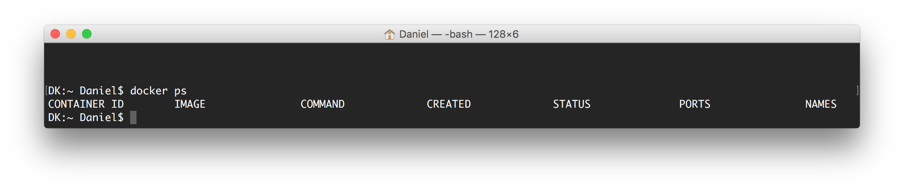
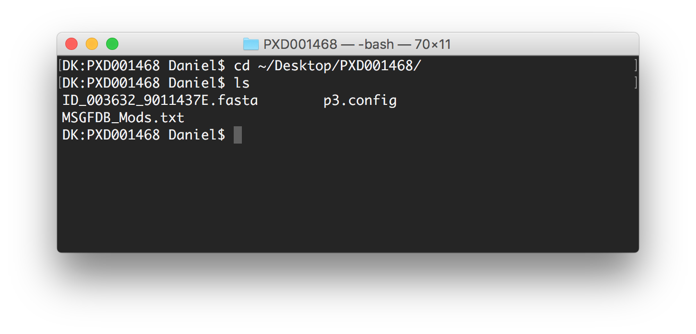
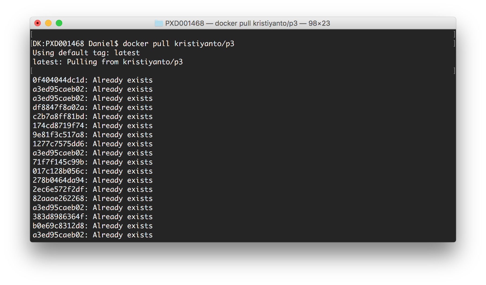
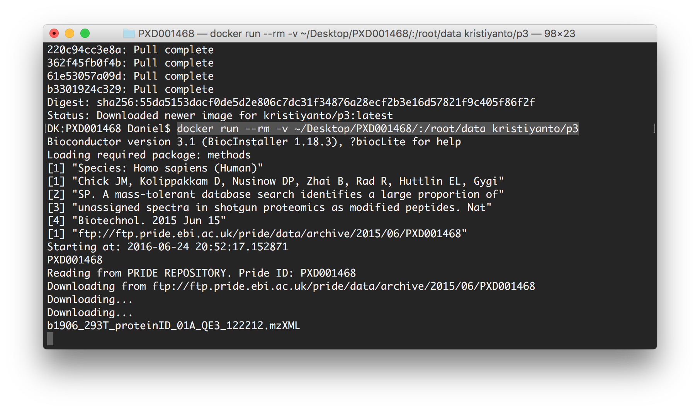

\rule{\textwidth}{1pt}


This is a use case/manual for a P3 pipeline with files retrieved from Pride database. 

1. Make sure [Docker engine](https://docs.docker.com/engine/installation/) is installed and running.
```
docker ps
```

2. Download a sample [p3.config](p3.config) and [MSGFDB_Mods.txt](MSGFDB_Mods.txt) file and put it to a directory. e.g. `~/Desktop/PXD001468`

```
cd ~/Desktop/PXD001468
```


in this case, ```p3.config``` must have the following fields:
```
REPO = FTP
FTP1 = (e.g: ftp://ftp.pride.ebi.ac.uk/pride/data/archive/2015/06/PXD001468) 
RUN_MSGF = (e.g: YES)
METHOD = (e.g: SPECTRUM_COUNT)
```

If other PrideID is desired, change the PRIDEID option in the p3.config. Ensure that the corresponding PrideID have the required files (\*.fasta, \*.mzml, etc.).


3. Download / update P3 from Dockerhub, and run the image.


```
eval $(docker-machine env default)
docker pull kristiyanto/p3
docker run --rm -v ~/Desktop/PXD001468:/root/data kristiyanto/p3
```



if necessary, another image can be run simultaneously (in a different terminal windows).
```
docker run --rm -v ~/Desktop/PXD001468:/root/data kristiyanto/p3
```

4. Once processes completed, the directory will be populated with:
+ Mass Spectometry files downloaded from Pride repository (\*.mzid, \*.mzml)
+ MSGF+ output files (\*.mzid, \*.canno, \*.revCat.cnlcp, *.revCat.csarr, \*.revCat.cseq)
+ Output table (\*.txt)
+ Output file as R objects (\*.rda)

***

If the process stop returning error:
* Make sure all the required files are in the folder. E.g: Fasta files sometimes are not provided in the FTP/Pride repository and must be provided manually. 
* Remove all \*.tmp files before re-run the containers.
